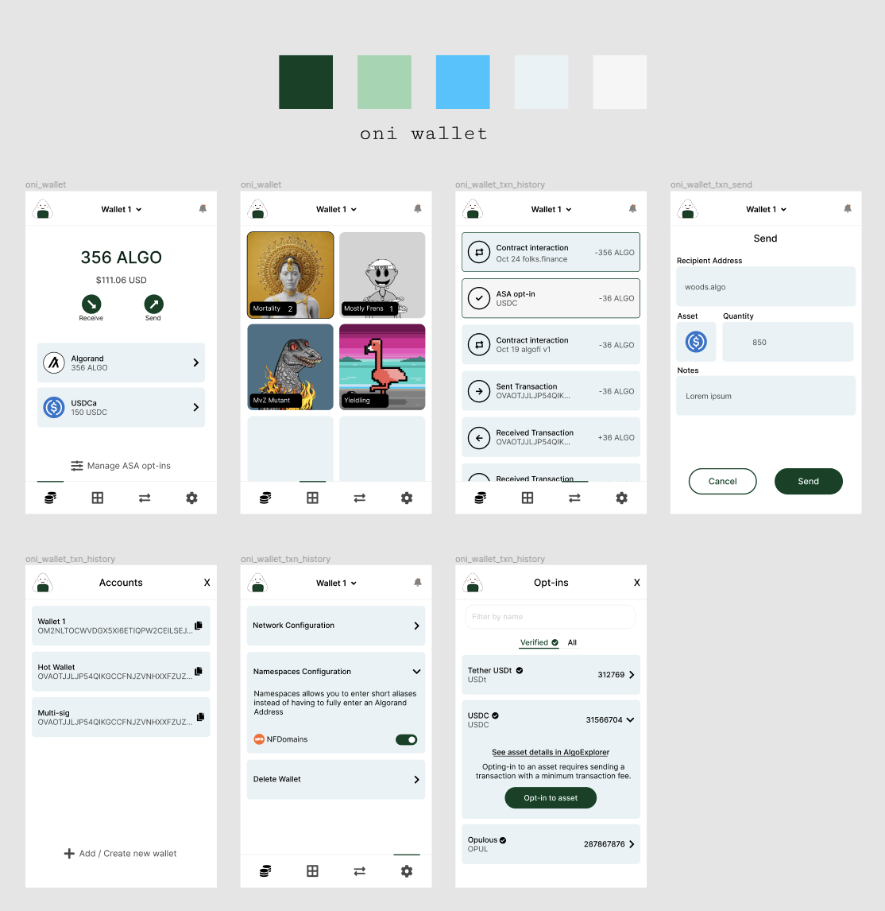

# Tauri + React + Typescript

This template should help get you started developing with Tauri, React and Typescript in Vite.

## Recommended IDE Setup

- [VS Code](https://code.visualstudio.com/) + [Tauri](https://marketplace.visualstudio.com/items?itemName=tauri-apps.tauri-vscode) + [rust-analyzer](https://marketplace.visualstudio.com/items?itemName=rust-lang.rust-analyzer)

## Requirements:

- WebRTC Rust: https://github.com/webrtc-rs/webrtc
- Passkey Rust: https://github.com/1Password/passkey-rs - authenticator and possibly client. Definitely want to explore HID transports
- BIP32+ed25519+addendum: https://github.com/algorandfoundation/bip32-ed25519-addendum 

## Extra Links

- OpenSK: https://github.com/google/OpenSK

# Brand Colors:

#1a4027

#a7d4b3

#5ac2fb

#eaf2f5

#f6f6f6

